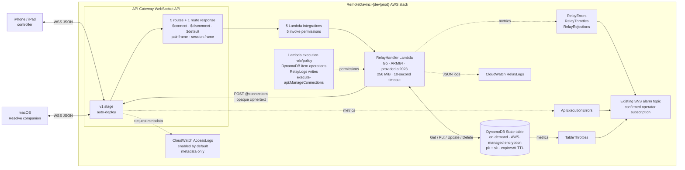

# Remote DaVinci

Accountless rendezvous and live encrypted relay for an iPhone/iPad controller
and a macOS DaVinci Resolve companion.

## What is here

- `protocol`: the versioned, language-neutral wire contract and Go validators.
- `services/rendezvous-relay`: WebSocket authorization, pairing, routing, and
  live ciphertext forwarding in one Lambda.
- `apps/controller/RemoteDavinciController.swiftpm`: the native iOS 17+
  SwiftUI controller for iPhone and iPad.
- `apps/companion`: the native macOS 14+ SwiftUI app and menu-bar companion.
- `cmd/companion` and `internal/companion`: its embedded Go server helper and
  loopback API; the browser GUI remains available for command-line development.
- `infra/cdk`: the TypeScript CDK stack for API Gateway, Lambda, DynamoDB, and
  operational alarms.
- `docs/capacity.md`: the capacity envelope, quota prerequisites, and cost
  model.

The relay sees routing metadata and opaque ciphertext. It does not queue
commands, terminate the peer-to-peer secure channel, or connect to Resolve.

## AWS architecture



## Local validation

```sh
make bootstrap
make check
```

Synthesize the development stack with `npm --prefix infra/cdk run synth`. It
targets `us-east-1` by default; pass CDK context `region` to the infrastructure
workspace to select another region. Deployment requires an AWS account
bootstrapped for CDK and is intentionally not performed by the test suite.

Production synthesis and deployment require an explicit account/region
allowlist plus an existing SNS topic in that same account and region:

```sh
npm --prefix infra/cdk run synth -- \
  -c environment=prod \
  -c productionAccount=123456789012 \
  -c productionRegion=us-east-1 \
  -c alarmTopicArn=arn:aws:sns:us-east-1:123456789012:remote-davinci-alerts
```

The CDK app refuses production when the allowlist differs from the account and
region resolved by the CDK toolkit. Before deployment, confirm the SNS topic
has at least one subscribed operator and test delivery. API Gateway access logs
are enabled by default with metadata-only fields and seven-day production
retention; configure the account-level API Gateway CloudWatch Logs role first.
Use `-c accessLogs=false` only as an explicit exception. The normal production
profile reserves 200 Lambda concurrency; `docs/capacity.md` lists the account
quota required before deployment.

## Run the vertical slice

Build and start the native macOS companion:

```sh
make companion-app
open '.derivedData/companion/Build/Products/Debug/Remote DaVinci Companion.app'
```

The app owns the window, menu bar, Launch at Login setting, and embedded helper
lifecycle. The helper chooses an ephemeral loopback port and gives its
launch-scoped API token only to the parent app. On first native launch, an
existing valid CLI configuration is copied to the login Keychain, verified,
and only then removed from disk. For Resolve control, launch DaVinci Resolve
Studio and allow command-line scripting in Resolve Preferences. The host-volume
control does not require Resolve.

Open `apps/controller/RemoteDavinciController.swiftpm` in Xcode, select a
development team and an iPhone or iPad running iOS 17 or later, and Run. Then:

1. Create an enrollment request on iOS.
2. Paste it into the companion app and create the link.
3. Paste the returned response into iOS and import it.
4. Keep the companion running, tap Connect, then use a page tab or the host
   mute control.

The app has blank Cut, Edit, Fusion, and Color tabs. Tapping one requests the
matching fixed operation (`resolve.page.cut`, `resolve.page.edit`,
`resolve.page.fusion`, or `resolve.page.color`); switching to one of those pages
inside Resolve updates the selected app tab. Unsupported Resolve pages leave
the last supported tab selected and are not changed automatically.
`host.volume.toggle-mute` remains the separate fixed macOS control. Remote raw
keys, shell commands, and user-authored scripts are not accepted.

Enrollment is a trusted, manual, one-operator ceremony for this slice. Transfer
both JSON documents directly between the unlocked controller and Mac without
an intermediary; that operator-controlled path is the authenticated channel.
The shipped apps do not run PAKE or negotiate operation grants. The originating
controller validates and persists its selected relay before emitting the
unchanged V1 identity request, then rejects a companion response for any other
relay. Accepting a response grants that one controller all five fixed V1
operations listed above.

The iOS app uses the device-only Keychain and the native Mac helper uses the
login Keychain. The standalone Go CLI is an explicitly insecure development
fallback: it requires `-allow-insecure-file-config` and a private, regular,
non-symlink mode-0600 configuration file. Its printed browser URL contains a
single-use bootstrap value rather than the API credential. Implement and review
the documented PAKE/QR ceremony and persisted per-operation grants before
onboarding anyone outside the one-trusted-operator boundary.
Both apps offer separately confirmed local-only recovery when remote revocation
cannot complete; it warns that the old relay identity may remain.

On macOS with Xcode installed, run both native app test targets with:

```sh
make companion-app-check
make controller-check
```

The complete deployment, device, failure-path, host-effect, and cleanup matrix
is in [`docs/e2e-test-plan.md`](docs/e2e-test-plan.md).

## V1 boundary

V1 is single-region, relay-only, and live-only. Direct peer connectivity,
offline command queues, accounts, push wake-up, media transfer, and arbitrary
Resolve scripting are deferred until a measured requirement justifies them.

Passing local tests proves the contract and infrastructure logic, not physical
iPhone/iPad pairing, mobile network roaming, or live Resolve control.

## Client transport requirements

Clients use WebSocket ping/pong control frames every five minutes, reconnect at
a randomized age between 90 and 110 minutes, and use full-jitter retry capped at
15 minutes after failures. Each side limits an active session to 60 encrypted
frames per second and may coalesce only supersedable controls such as jog or
scrub updates.

Successful `pair.frame` and `session.frame` messages are intentionally silent.
The relay returns a correlated protocol error when it rejects a frame; an
application response from the encrypted peer is the only end-to-end delivery
confirmation.
