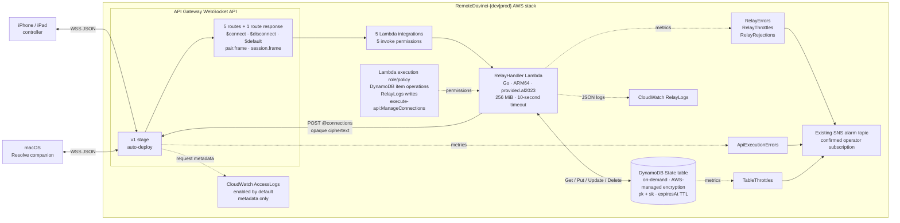

# Remote DaVinci

Accountless rendezvous and live encrypted relay for an iPhone/iPad controller
and a macOS DaVinci Resolve companion.

## Run the Mac companion and iPhone app

For normal use, start only the **Remote DaVinci Companion** app on the Mac. It
automatically launches and supervises its embedded Go server helper; do not run
the standalone Go CLI at the same time.

Both apps connect outbound to the same preconfigured hosted WSS relay. The
iPhone never connects directly to the helper's loopback port, so the devices do
not need to share Wi-Fi and there is no Mac IP address, inbound firewall rule,
port forwarding, Node install, AWS account, or relay deployment to configure.

### Prerequisites

- An Apple Silicon Mac running macOS 14 or later.
- Full Xcode with Swift 6 and an iOS 17 or later runtime.
- Go 1.26.6, as declared by `go.mod`, available to Xcode.
- An iPhone or iPad running iOS 17 or later. A physical device needs a passcode,
  an Xcode development team, device trust, and Developer Mode. An iOS simulator
  is enough for an initial local trial.
- Internet access from both devices.
- DaVinci Resolve Studio only for Resolve page controls. Mac mute control works
  without Resolve.

Run shell commands below from the repository root.

### 1. Build and start the Mac companion

```sh
make companion-app
open '.derivedData/companion/Build/Products/Debug/Remote DaVinci Companion.app'
```

The first command builds a locally signed development app and embeds the helper.
On a fresh installation, wait for the one-time pairing QR code and the
connection status **Not enrolled**.
Leave the companion running while using the controller. Closing its window
leaves the menu-bar app running; use **Quit Remote DaVinci Companion** to stop
the helper.

### 2. Prepare Resolve page control

Skip this step if you only want to test Mac mute.

1. Open DaVinci Resolve Studio and a project.
2. Choose **DaVinci Resolve > Preferences > System > General**.
3. Set **External scripting using** to **Local**, save, and keep Resolve running.

The companion uses Resolve's local scripting module. It does not require
Network scripting, port 9060, raw keyboard access, or Accessibility permission.

### 3. Run the iPhone or iPad controller

```sh
open -a Xcode apps/controller/RemoteDavinciController.swiftpm
```

In Xcode, select the **RemoteDavinciController** scheme, then choose a run
destination:

- For a simulator, choose an iPhone or iPad simulator and press Run.
- For a physical device, select a development team under Signing, connect and
  unlock the device, trust the Mac, enable Developer Mode if prompted, choose
  the device, and press Run.

If Xcode reports that `dev.remote-davinci.controller` is unavailable, change the
application's bundle identifier in `Package.swift` to a unique reverse-DNS
value. The app opens its **Settings** sheet automatically when it is not
enrolled.

### 4. Pair the controller

1. On iOS, keep or edit **Device label**, then tap **Scan Mac QR Code**.
2. Allow camera access and scan the one-time code shown by the Mac companion.
3. When the Mac shows the controller label, security fingerprint, and five
   requested controls, verify the device and click **Approve**.
4. Both apps save the pairing in Keychain and the controller connects
   automatically. Success is **Connected** with **Ready** on iOS and
   **Secure controller session** on the Mac.

The code expires after five minutes and contains independent 256-bit relay
admission and Noise PSK secrets. The relay stores only the admission-token hash
and never receives the PSK. The apps authenticate the exchange with
`Noise_NNpsk0_25519_ChaChaPoly_SHA256`; approval grants only the five fixed V1
controls.

If the camera is unavailable, expand **Advanced Manual Enrollment** on iOS and
**Manual enrollment (advanced)** on the Mac. Transfer both JSON documents
directly between the unlocked devices, such as with AirDrop or Universal
Clipboard. This fallback is for one trusted operator, not remote onboarding.

### 5. Control the Mac

Tap **Done**, then select the Cut, Edit, Fusion, or Color tab. The tab body is
intentionally blank: selecting the tab itself asks Resolve to open that page.
Changing to one of those pages inside Resolve updates the selected iOS tab.
Media, Fairlight, and Deliver are outside this V1 controller and leave the last
supported tab selected.

Mac mute remains under **Settings > Host control**. Controls stay disabled until
the secure session is ready. Backgrounding the iOS app intentionally
disconnects it; tap **Connect** again after returning.

### Troubleshooting

| Symptom | What to check |
| --- | --- |
| The Mac build says Go is required | Confirm `go version` works in Terminal, then rebuild the companion. |
| Mac shows **Server stopped** or a startup error | Unlock the login Keychain and click **Retry Server**. If it reports a missing helper, rebuild the companion. |
| Physical-device build will not sign | Select your team, enable automatic signing, and use a unique bundle identifier. |
| **Connect** is disabled | Finish QR pairing or import the advanced manual response so the status is **Enrolled**. |
| Camera access is unavailable | Enable it in Settings, paste a decoded pairing code, or use advanced manual enrollment. |
| The QR code expired or pairing was rejected | Generate a fresh code on the Mac, scan it, and approve that attempt. |
| iOS stays at **Waiting for companion** | Keep the Mac companion running and confirm both apps were paired against the same relay. |
| Page control reports `resolve.unavailable` | Run Resolve Studio from its standard installation, open a project, and set external scripting to **Local**. |
| Page or mute controls are disabled | Wait for iOS **Connected / Ready** and Mac **Secure controller session**. |
| Mute reports `host.mute-unsupported` | The current output device does not expose a macOS mute property. |
| Pairing is unavailable for a new device | The Mac supports one controller. Revoke and reset the old pairing first. |

Use **Revoke and Reset** on the Mac or **Revoke and Re-enroll** on iOS while the
relay is reachable. The separately confirmed local-forget actions are emergency
recovery only: they can leave the old relay identity active.

### Use a custom relay

The default quick start does not need this. Before pairing or creating a manual
enrollment, open the companion project as well:

```sh
open -a Xcode apps/companion/RemoteDavinciCompanion.xcodeproj
```

In the Run action for each scheme, add the identical canonical
`REMOTE_DAVINCI_RELAY_URL` value under **Product > Scheme > Edit Scheme > Run >
Arguments > Environment Variables**. The value must be a credential-free
`wss://` URL.

Run both apps from Xcode for that pairing. The controller pins the relay in
Keychain; changing it later requires revocation and pairing again.

## Documentation

- [`protocol/README.md`](protocol/README.md): canonical wire protocol, trust
  boundary, authenticated QR pairing, and advanced manual fallback.
- [`docs/e2e-test-plan.md`](docs/e2e-test-plan.md): release-validation matrix for
  simulators, physical devices, AWS, Resolve, and host effects.
- [`docs/capacity.md`](docs/capacity.md): relay quotas, load targets, and cost
  model.
- [`SECURITY.md`](SECURITY.md): private vulnerability-reporting process.

## Project layout

- `protocol`: the versioned, language-neutral wire contract and Go validators.
- `services/rendezvous-relay`: WebSocket authorization, pairing, routing, and
  live ciphertext forwarding in one Lambda.
- `apps/controller/RemoteDavinciController.swiftpm`: the native iOS 17+
  SwiftUI controller for iPhone and iPad.
- `apps/companion`: the native macOS 14+ SwiftUI app and menu-bar companion.
- `cmd/companion` and `internal/companion`: the embedded Go helper and loopback
  API. The browser GUI is a separate command-line development fallback.
- `infra/cdk`: the TypeScript CDK stack for API Gateway, Lambda, DynamoDB, and
  operational alarms.

The relay sees routing metadata and opaque ciphertext. It does not queue
commands, terminate the peer-to-peer secure channel, or connect to Resolve.

## Development validation

Go, relay, protocol, and infrastructure checks use the Go version from `go.mod`
and Node 24:

```sh
make bootstrap
make check
```

The native companion tests and fast Mac Catalyst controller tests require
Xcode:

```sh
make companion-app-check
make controller-check
```

`controller-check` is not an iOS simulator or physical-device test. The complete
deployment, device, failure-path, host-effect, and cleanup matrix is in
[`docs/e2e-test-plan.md`](docs/e2e-test-plan.md).

## AWS infrastructure development

These commands are optional and are not part of the app quick start. Synthesize
the development stack with `npm --prefix infra/cdk run synth`. It targets
`us-east-1` by default; pass CDK context `region` to select another region.
Deployment requires a CDK-bootstrapped AWS account and is intentionally not
performed by the test suite.

Production synthesis and deployment require an explicit account/region
allowlist plus an existing SNS topic in that same account and region:

```sh
npm --prefix infra/cdk run synth -- \
  -c environment=prod \
  -c productionAccount=123456789012 \
  -c productionRegion=us-east-1 \
  -c alarmTopicArn=arn:aws:sns:us-east-1:123456789012:remote-davinci-alerts
```

The CDK app refuses production when the allowlist differs from the account and
region resolved by the CDK toolkit. Before deployment, confirm the SNS topic
has at least one subscribed operator and test delivery. API Gateway access logs
are enabled by default with metadata-only fields and seven-day production
retention; configure the account-level API Gateway CloudWatch Logs role first.
Use `-c accessLogs=false` only as an explicit exception. The production stack
uses regional unreserved Lambda concurrency;
[`docs/capacity.md`](docs/capacity.md) lists the capacity prerequisites.

## AWS architecture



## V1 boundary

V1 is single-region, relay-only, and live-only. Direct peer connectivity,
offline command queues, accounts, push wake-up, media transfer, and arbitrary
Resolve scripting are deferred until a measured requirement justifies them.

Passing local tests proves the contract and infrastructure logic, not physical
iPhone/iPad pairing, mobile network roaming, or live Resolve control.

## Client transport requirements

Clients use WebSocket ping/pong control frames every five minutes, reconnect at
a randomized age between 90 and 110 minutes, and use full-jitter retry capped at
15 minutes after failures. Each side limits an active session to 60 encrypted
frames per second and may coalesce only supersedable controls such as jog or
scrub updates.

Successful `pair.frame` and `session.frame` messages are intentionally silent.
The relay returns a correlated protocol error when it rejects a frame; an
application response from the encrypted peer is the only end-to-end delivery
confirmation.
