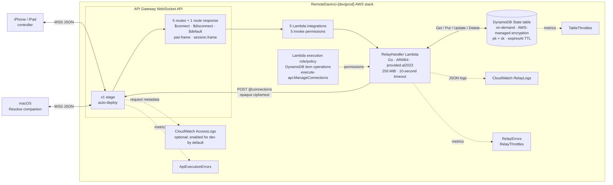

# Remote DaVinci

Accountless rendezvous and live encrypted relay for an iPhone/iPad controller
and a macOS DaVinci Resolve companion.

## What is here

- `protocol`: the versioned, language-neutral wire contract and Go validators.
- `services/rendezvous-relay`: WebSocket authorization, pairing, routing, and
  live ciphertext forwarding in one Lambda.
- `infra/cdk`: the TypeScript CDK stack for API Gateway, Lambda, DynamoDB, and
  operational alarms.
- `docs/capacity.md`: the capacity envelope, quota prerequisites, and cost
  model.

The relay sees routing metadata and opaque ciphertext. It does not queue
commands, terminate the peer-to-peer secure channel, or connect to Resolve.

## AWS architecture



## Local validation

```sh
make bootstrap
make check
```

Synthesize the development stack with `npm --prefix infra/cdk run synth`. It
targets `us-east-1` by default; pass CDK context `region` to the infrastructure
workspace to select another region. Deployment requires an AWS account
bootstrapped for CDK and is intentionally not performed by the test suite.

## V1 boundary

V1 is single-region, relay-only, and live-only. Direct peer connectivity,
offline command queues, accounts, push wake-up, media transfer, and arbitrary
Resolve scripting are deferred until a measured requirement justifies them.

Passing local tests proves the contract and infrastructure logic, not physical
iPhone/iPad pairing, mobile network roaming, or live Resolve control.

## Client transport requirements

Clients use WebSocket ping/pong control frames every five minutes, reconnect at
a randomized age between 90 and 110 minutes, and use full-jitter retry capped at
15 minutes after failures. Each side limits an active session to 60 encrypted
frames per second and may coalesce only supersedable controls such as jog or
scrub updates.

Successful `pair.frame` and `session.frame` messages are intentionally silent.
The relay returns a correlated protocol error when it rejects a frame; an
application response from the encrypted peer is the only end-to-end delivery
confirmation.
